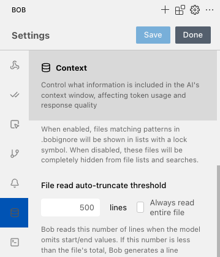

# Data Science Lab

Learn how to perform data analysis and create interactive dashboards with Bob.

## Overview

In this lab, you'll take on the role of a data scientist working with real-world data. Your mission is to analyze a dataset and create meaningful interactive dashboards for executives through a web application.

## Learning Objectives

You'll discover how to use Bob to:
- Perform data analysis
- Create interactive dashboards using [Jupyter notebooks](https://jupyter.org/)
- Build web applications with [Streamlit](https://streamlit.io/)

## Dataset

The dataset comes from [Kaggle](https://www.kaggle.com/datasets/akshatsharma2/global-jobs-gdp-and-unemployment-data-19912022/) and is open source, free to use.

This comprehensive dataset provides a 30-year view of global employment, unemployment, and GDP trends from 1991 to 2022. It includes data from approximately 183 countries, covering:
- Employment distribution across agriculture, industry, and services sectors
- Unemployment rates
- GDP figures

You can examine the data using standard tools like Excel or Numbers.

## Lab Structure

This lab is divided into the following sections:

1. **Data Discovery** - Automatically exploring the dataset
2. **Data Analysis** - Performing analysis with Jupyter Notebooks
3. **Dashboard Creation** - Building interactive dashboards with Streamlit
4. **Database Connectivity** - Connecting the dashboard to PostgreSQL

Each section can be completed independently without requiring the other steps.

## Prerequisites

This lab doesn't require deep knowledge of Python or data science skills. Some commands will be executed in a terminal - if any errors occur, simply copy/paste them to Bob for correction.

First, install `uv` for package management. Open a terminal and run:

```
pip install uv
uv venv
source .venv/bin/activate
```

Ensure Bob will not read full files for easier prompt assistance: "Always read entire file" must not be selected.


## Lab Steps

### 1. Discovering the Data

Switch to Ask mode and run:

```
I have data in @/Employment_Unemployment_GDP_data.csv
Can you describe the data and what you understand from it?
Can you describe what kind of analysis and charts I can imagine to build on top of it?
Also the Python stack I will need to use?
```

Switch to Code mode and run:
```
Please write this in a IDEAS.MD file.
```

Bob will analyze the data and create an IDEAS.MD file outlining potential analyses and visualizations.

### 2. Data Analysis with Jupyter

Create a new Bob task in Code mode and run:

```
I need to analyze this data with python.

Use standard stack: numpy, pandas, scikit-learn, matplotlib, plotly, ipykernel...
Create requirements.txt file but let the libraries version free, don't fix them.
Use the local .venv if needed
Add .gitignore if needed with usual stuff.

Create a notebook which simply explores the data and describes it.
```

After execution, install the requirements:

```
uv pip install -r requirements.txt
```

Open the notebook in Visual Studio Code, set the kernel to use the .venv, and execute all cells. You can ask Bob to add specific data analyses to the notebook as needed.

### 3. Creating Interactive Dashboards

Clear the notebook cells, save it, and run a new Bob task in Code mode:

```
Forget the notebook. 
I want a streamlit application with plotly interactive charts to analyze the data from the DB. 
Each tab will have its own settings in the tab. The settings must not be on the left panel.
For ease of maintenance, each tab will go in its own file, which names will be the tab name.
Add explanations over the charts and what we need to be careful about when analyzing.
Selection of country is via a menu, selection of year via a slider.
Only use streamlit's built-in tabs
Beware of duplicate elements.

Right now, I only want a single tab "Statistical analysis" with charts which will help understand the data, such as distribution charts and pies. 
United States will be the default selected country.

I will run the app manually.
Update requirements.txt if needed.
```

Install any new requirements:

```
uv pip install -r requirements.txt
```

Start the application:

```
streamlit run app.py
```

(Bob may provide a different command if the app is in a subdirectory)

Enhance the dashboard with additional visualizations:

```
Add a tab "Geographical analysis" where we select the year and the data attribute, and it will display the data on a map of the world. 
Add a tab "Country Comparison" to compare 2 countries.
```

Restart the app or click "Rerun" to see the changes.

If you hit an error, for example 
```
streamlit.errors.StreamlitDuplicateElementId: There are multiple slider elements with the same auto-generated ID. When this element is created, it is assigned an internal ID based on the element type and provided parameters. Multiple elements with the same type and parameters will cause this error.

To fix this error, please pass a unique key argument to the slider element.
```
Just copy/paste it to Bob for a fix.

### 4. Database Connectivity

Create a new Bob task:

```
In fact, the data from my streamlit app may come from a postgresql database.
The DATABASE_URL would be in a .env 
If present use it, otherwise stick to the local CSV. 
Add a sentence in the app to say if you are using postgresql or csv dataset.
Use sqlalchemy 
Update requirements.txt if needed.
```

Then install the new dependencies from requirements.txt and restart the app.

### 5. Code Review

Before deployment, ask Bob to review the code via a new task:

```
Review the python files to check the code quality.
Check for duplicated code and refactor.
```

This ensures the application is ready for deployment with clean, maintainable code.
